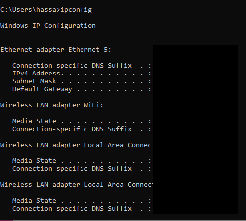
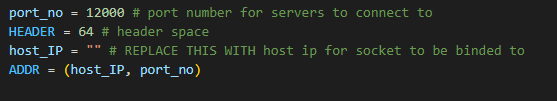

# Intelligent job scheduler

1. To run code, you need to initally run the command "ipconfig" in cmd on the CLIENT MAIN PC

2. Once you have retained the IP adress of your system, fill in the host ip variable in BOTH client code and server code

3. Run FIRSTLY the client main executable
4. Press "start program" button. THIS IS MUST OR PROGRAM WILL NOT WORK
5. Then run server instance executable on the PC(s) you desire to connect
6. Now you can use the program as you wish

